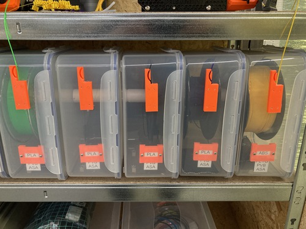
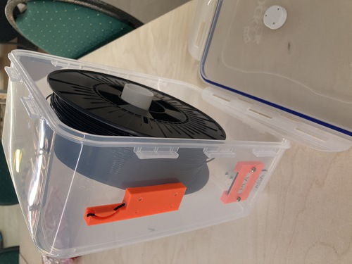
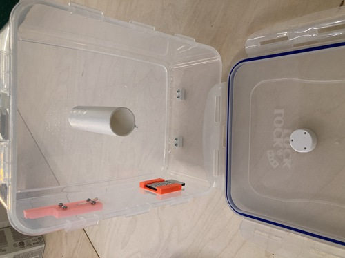
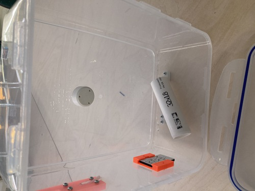
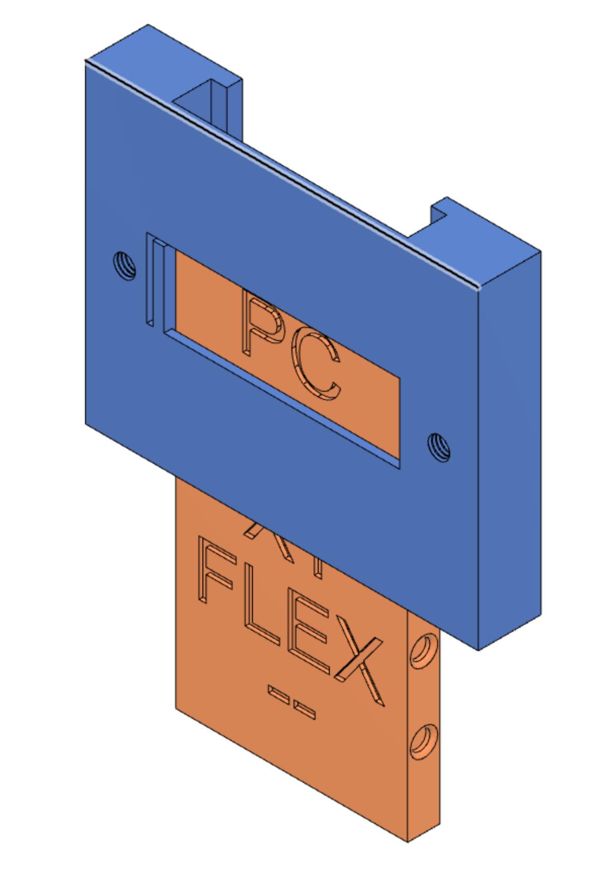
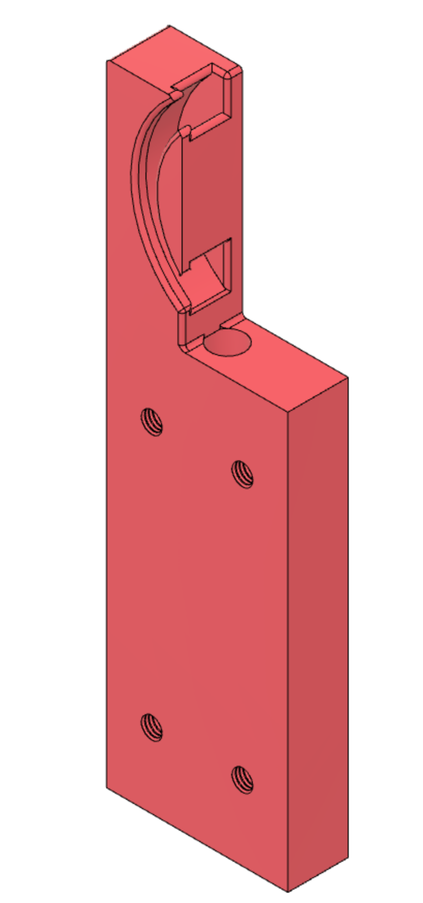
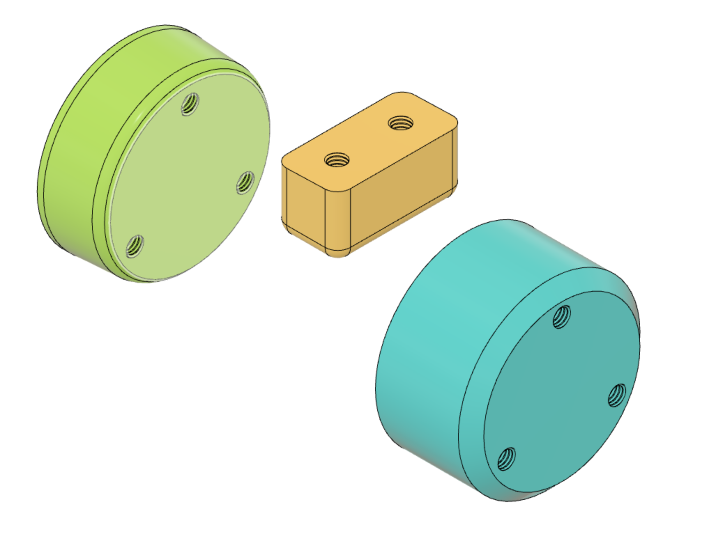
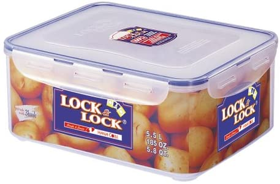
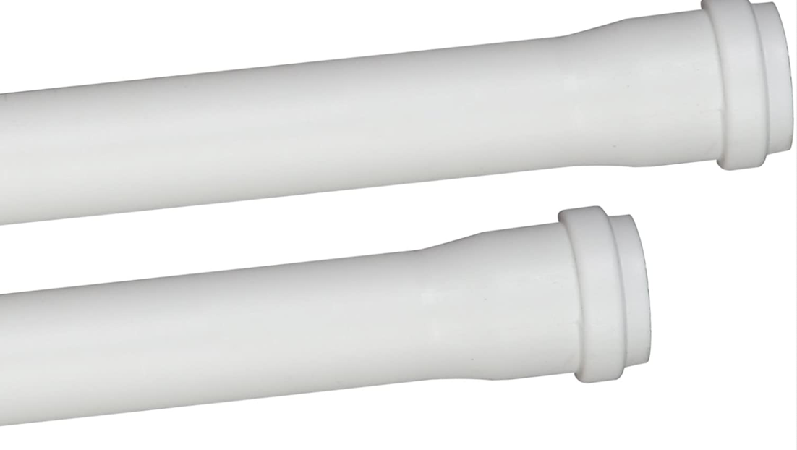

# Filament container
Filament container for 3d printer 

### Fotos

|     |     |     |
| --- | --- | --- |
|  |  |  |

### Teile
| Beschriftung.f3d  | Filamentoutlet.f3d | HalterUndFuss.f3d  |
| --- | --- | --- |
|  |  |  |

| Lock&Lock HPL836  | HT Rohr DN 32 | Entfeuchter  |
| --- | --- | --- |
|   |   |  |

Lock&Lock HPL836 : https://amzn.to/3yocPfv (*)

HT Rohr DN 32    : https://amzn.to/3wBrhhN (*)

Entfeuchter      : https://amzn.to/3kX95cM (*)

Affiliatelinks/Werbelinks: Die mit Sternchen (*) gekennzeichneten Links sind sogenannte Affiliate-Links. Wenn Du auf so einen Affiliate-Link klickst und über diesen Link einkaufst, erhalten wir (die Makerhafen gemeinnützige GmbH) von Amazon eine Provision. Für Dich verändert sich der Preis nicht.

